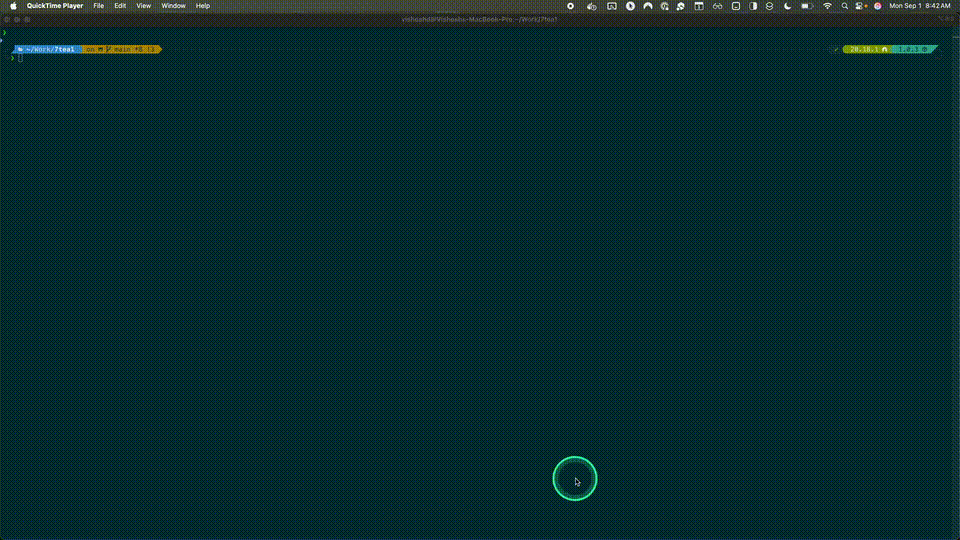

# Claude DevContainer Ecosystem

**Fast, isolated local development with Claude Code across multiple git worktrees, native host builds via SSH, and `--dangerously-skip-permissions` for maximum development speed.**

A comprehensive DevContainer-based development environment for local development that enables seamless multi-worktree development, containerized Claude Code with unrestricted permissions, and native host system builds through SSH integration. All Docker images are built locally on your machine.

[](https://github.com/visheshd/claude-devcontainer/actions/workflows/build-images.yml)

> ⚠️ **CRITICAL: Worktree Creation Requirements**
> 
> **ALWAYS use the provided `wt` command to create git worktrees.** Manual `git worktree add` will NOT configure DevContainers properly and will cause mount path errors.
> 
> ✅ **Correct**: `wt my-feature` or `cdc wt my-feature`  
> ❌ **Wrong**: `git worktree add ../my-feature` (breaks DevContainer setup)

📋 **MCP Setup Guide**: See [MCP_SERVERS.md](MCP_SERVERS.md) for customizing or adding more MCP servers

> ⚠️ **Important**: All Docker images must be built locally. This project does not provide pre-built images on Docker Hub or other registries. You must run the build process on your machine before using any DevContainer configurations.

## 🎯 Key Benefits

✅ **Native IDE Integration**: Seamless VS Code, Cursor, and compatible editor support  
✅ **Stack Optimization**: Purpose-built containers for Python ML, Rust Tauri, Next.js  
✅ **Complete Isolation**: No conflicts between different tech stacks or projects  
✅ **MCP Integration**: Built-in serena and context7 MCP servers for enhanced AI assistance  
✅ **Fast Startup**: Optimized containers with intelligent layering  
✅ **Automated Worktrees**: Git wrapper system handles worktree operations seamlessly  
✅ **Cross-Platform**: Full compatibility across Apple Silicon, Intel, and Linux  
✅ **SSH Host Builds**: Native builds on host system for optimal performance  



## 🚀 Quick Start

### 1. Install CLI Tool
```bash
# Install the CLI tool locally (one-time setup)
cd tools/claude-devcontainer
npm install
npm link

# Available commands after installation:
# claude-devcontainer (full command)
# cdc (short alias - saves typing!)
# wt (standalone worktree command)
```

### 2. Choose Your Development Stack
```bash
# See available stacks (both commands work identically)
claude-devcontainer stacks
cdc stacks
```

### 3. Build Required Images
Build only the images you need (saves time & disk space):

```bash
# Example: For Python ML development
./build-all-images.sh --images claude-base,python-ml

# Example: For Next.js development  
./build-all-images.sh --images claude-base,nextjs

# Example: For Rust Tauri development
./build-all-images.sh --images claude-base,rust-tauri

# Or build all images if you plan to work with multiple stacks
./build-all-images.sh --rebuild
```

### 4. Create Main Project DevContainer
```bash
# Create new project with DevContainer (will prompt for stack selection)
claude-devcontainer init
# OR use the short alias:
cdc init
```

> ⚠️ **Security Notice**: This will create a DevContainer that mounts your personal `~/.claude` directory (containing API tokens, settings, and credentials). See [Security & Privacy Notice](#-security--privacy-notice) for details and opt-out instructions.

### 5. Create Feature Worktrees (Recommended Workflow)
> ⚠️ **REQUIRED**: Use ONLY these commands to create worktrees. Manual `git worktree add` will break DevContainer setup.

```bash
# ✅ CORRECT: Use the provided wt command (all work identically)
claude-devcontainer wt my-feature    # Full command
cdc wt my-feature                   # Short alias  
wt my-feature                       # Standalone command

# ❌ WRONG: Never use manual git worktree commands
# git worktree add ../my-feature    # This breaks DevContainer configuration!

# This creates: ../project-name-my-feature/ with DevContainer ready
# The wt command automatically configures proper mount paths and environment variables
```

### 6. Open Worktree in VS Code
```bash
# Navigate to your new worktree
cd ../project-name-my-feature

# Open in VS Code
code .
# Command Palette: "Dev Containers: Reopen in Container"
```

### 7. Worktree Cleanup (Automatic + Manual)
```bash
# AUTOMATIC: After merging your feature back to main:
git merge my-feature
# The post-merge hook will automatically prompt to clean up

# MANUAL: Clean up worktrees anytime with standalone commands:
cdc cleanup --list                    # See all worktrees and Docker artifacts
cdc cleanup my-feature                # Clean specific worktree
cdc cleanup --interactive             # Choose which worktrees to clean
cdc cleanup --merged                  # Clean all merged branches
cdc cleanup --dry-run --merged        # Preview what would be cleaned

# This prevents "zombie" Docker artifacts from accumulating
```

### 8. Fix Existing DevContainers (Optional)
```bash
# If you have old devcontainer configs that lack worktree detection
cd existing-project

# Check what needs upgrading
claude-devcontainer check

# Upgrade to latest with worktree detection
claude-devcontainer migrate
```

### CLI Commands

```bash
# Initialize a new DevContainer configuration
claude-devcontainer init
cdc init                                  # Short alias

# Create git worktrees for feature development (⚠️ REQUIRED: Use these commands only!)
claude-devcontainer wt my-feature        # Full command
cdc wt my-feature                        # Short alias  
wt my-feature                            # Standalone command
# ❌ NEVER: git worktree add (breaks DevContainer setup)

# Clean up git worktrees and Docker artifacts
claude-devcontainer cleanup my-feature   # Clean specific worktree
cdc cleanup --list                       # List all worktrees and artifacts
cdc cleanup --interactive               # Interactive cleanup
cdc cleanup --merged                     # Clean merged branches only
cdc cleanup --dry-run --all             # Preview cleanup without doing it
cdc cleanup --merged --verbose          # Debug merged branch detection

# Analyze existing DevContainer configuration
claude-devcontainer check
cdc check                                # Short alias

# Upgrade existing DevContainer to latest features (includes worktree detection)
claude-devcontainer migrate
cdc migrate                              # Short alias

# Detect project type
claude-devcontainer detect
cdc detect                               # Short alias

# List available development stacks
claude-devcontainer stacks
cdc stacks                               # Short alias

# Multi-service specific commands
claude-devcontainer services             # List multi-service templates
cdc services                             # Short alias
claude-devcontainer compose <template>   # Initialize with specific template
cdc compose <template>                   # Short alias
```

## 🐳 Multi-Service Container Support

The Claude DevContainer system now supports **both single-container and multi-service** setups to match your project's complexity:

### When to Use Multi-Service
- **Database Required**: Projects using PostgreSQL, MongoDB, or other databases
- **Caching Needed**: Applications requiring Redis or similar caching
- **Background Jobs**: Projects with queues, workers, or scheduled tasks
- **Full-Stack Apps**: Complete web applications with multiple components
- **Microservices**: Multi-service architectures

### Multi-Service vs Single-Container

| Aspect | Single Container | Multi-Service |
|--------|------------------|---------------|
| **Setup** | Simple, one image | Docker Compose with multiple services |
| **VS Code Connection** | Direct to container | Connects to primary `app` service |
| **Use Case** | Simple projects, prototyping | Complex apps, full-stack development |
| **Services** | All-in-one | Specialized services (DB, cache, workers) |
| **Resource Usage** | Lower | Higher (multiple containers) |

### Multi-Service Architecture

```
┌─────────────────┐    ┌──────────────────┐
│   VS Code       │────│  Primary Service │ ← VS Code connects here
│   (Local)       │    │  "app"           │   (Claude Code + dev tools)
└─────────────────┘    │  - Claude Code   │
                       │  - Source code   │
                       │  - Build tools   │
                       └─────────┬────────┘
                                 │ Docker network
                                 │
                    ┌────────────┼────────────┐
                    │            │            │
              ┌─────▼────┐ ┌─────▼────┐ ┌────▼─────┐
              │PostgreSQL│ │ Redis    │ │Background│
              │Service   │ │Service   │ │Worker    │
              └──────────┘ └──────────┘ └──────────┘
```

### Quick Start Examples

**Web Application with Database:**
```bash
claude-devcontainer init --stack web-db
cdc init --stack web-db                    # Short alias
# Creates Next.js + PostgreSQL + Redis setup
```

**ML Application with Services:**
```bash
claude-devcontainer compose python-ml-services
cdc compose python-ml-services             # Short alias  
# Creates Python ML + Vector DB + Redis Stack
```

**Complete Full-Stack Application:**
```bash
claude-devcontainer compose fullstack-nextjs
cdc compose fullstack-nextjs               # Short alias
# Creates comprehensive setup with all services
```

### Backward Compatibility

**Existing projects continue to work unchanged** - no migration required:
- Single-container setups remain fully supported
- All existing CLI commands work as before
- Migration to multi-service is optional and user-initiated

## 🏗️ Architecture

### Layer 1: Base Image (Local Build)
- **claude-base**: Foundation with Claude Code + essential dev tools
- **Components**: Node.js 20, Git, SSH, oh-my-zsh, authentication setup
- **Build locally**: `./dockerfiles/claude-base/build.sh`

### Layer 2: Stack Images (Local Builds)
- **claude-python-ml**: Python 3.11+, uv, ML libraries, Jupyter, LangChain
- **claude-rust-tauri**: Rust toolchain, Tauri v2, cross-compilation support
- **claude-nextjs**: Node.js optimized, pnpm (not npm), modern web development tools
- **Build all**: `./build-all-images.sh --rebuild`

### Layer 3: DevContainer Features
- **claude-mcp**: Configurable MCP server installation and management
- **host-ssh-build**: SSH-based builds on host system (macOS native builds)
- **git-wrapper**: Baked into base image, handles worktree path transformations automatically

## 📋 Available Stacks (Local Builds)

### Single Container Stacks

| Stack | Local Image Tag | Use Case | Key Features |
|-------|-----------------|----------|--------------|
| **Python ML** | `claude-python-ml:latest` *(local)* | AI/ML Development | Python 3.11, Jupyter, LangChain, PyTorch, Vector DBs |
| **Rust Tauri** | `claude-rust-tauri:latest` *(local)* | Desktop Apps | Rust toolchain, Tauri v2, Cross-compilation, GUI libs |
| **Next.js** | `claude-nextjs:latest` *(local)* | Web Development | Node.js, pnpm, TypeScript, Tailwind, Modern web tools |
| **Custom** | `claude-base:latest` *(local)* | General Purpose | Base environment for custom configurations |

### Multi-Service Stacks

| Stack | Template | Services | Use Case | Key Features |
|-------|----------|----------|----------|--------------|
| **Web + Database** | `web-db-stack` | App, PostgreSQL, Redis | Web apps with database | Next.js, PostgreSQL, Redis, full-stack development |
| **Python ML Services** | `python-ml-services` | App, Vector DB, Redis | ML applications | Python ML, pgvector, Redis Stack, Jupyter, model serving |
| **Full-Stack App** | `fullstack-nextjs` | App, Worker, DB, Redis, Mail, Storage | Complete web applications | Next.js, background jobs, email testing, S3 storage |

## 🔨 Building Images Locally

### Prerequisites
- Docker installed and running
- At least 1-2GB free disk space per stack
- Claude Code already authenticated on your host system

### Recommended: Build Only What You Need
```bash
# Build base image + your chosen stack (saves time & disk space)
chmod +x build-all-images.sh

# Python ML stack (~2GB total)
./build-all-images.sh --images claude-base,python-ml

# Next.js stack (~1.5GB total) 
./build-all-images.sh --images claude-base,nextjs

# Rust Tauri stack (~2.5GB total)
./build-all-images.sh --images claude-base,rust-tauri
```

### Alternative: Build All Images
```bash
# Build all images if working with multiple stacks (~4GB total)
./build-all-images.sh --rebuild
```

### Individual Image Builds
```bash
# Build base image first (required by others)
cd dockerfiles/claude-base
./build.sh

# Build stack images (requires claude-base)
cd ../python-ml && ./build.sh --base-image claude-base:latest
cd ../rust-tauri && ./build.sh --base-image claude-base:latest
cd ../nextjs && ./build.sh --base-image claude-base:latest
```

### Build Options
```bash
# Parallel build for faster completion
./build-all-images.sh --parallel --rebuild

# Build without cache for clean builds
./build-all-images.sh --no-cache --rebuild

# See all available options
./build-all-images.sh --help
```

## 🎨 Custom Images and Extensibility

The Claude DevContainer system is designed for extensibility. You can create custom images for specialized environments while maintaining full compatibility with the Claude toolchain.

### Image Architecture (All Local Builds)

```
claude-base:latest              # Foundation with Claude Code, git, build tools (local)
├── claude-python-ml:latest     # + Python 3.11, ML libraries, Jupyter (local)
├── claude-rust-tauri:latest    # + Rust toolchain, Tauri v2, GUI deps (local)
├── claude-nextjs:latest        # + Node.js, Bun, TypeScript tools (local)
└── your-custom:latest          # + Your specialized tools (local)
```

### Creating Custom Images

**Basic extension example:**
```dockerfile
FROM claude-base:latest

USER root
RUN apt-get update && apt-get install -y postgresql-client redis-tools \
    && rm -rf /var/lib/apt/lists/*

USER claude-user
RUN curl -fsSL https://get.pnpm.io/install.sh | sh

WORKDIR /workspace
```

**Using your custom image:**
```bash
# Build your custom image
docker build -t my-custom-claude:latest .

# Initialize DevContainer with custom stack
claude-devcontainer init -s custom

# Edit .devcontainer/devcontainer.json to use your image
{
  "image": "my-custom-claude:latest",
  // ... other configuration
}
```

### Documentation and Examples

- **[Custom Images Guide](docs/custom-images/README.md)** - Complete guide to creating custom images
- **[Example Dockerfiles](docs/custom-images/)** - Ready-to-use examples for common scenarios:
  - Basic extension with common tools
  - Database development environment
  - Multi-language development setup
  - DevOps and infrastructure tools
  - Scientific computing environments

### Best Practices

1. **Always extend `claude-base:latest`** for compatibility
2. **Follow the USER pattern** (root for system, claude-user for user tools)
3. **Clean up package caches** to keep images lean
4. **Use environment variables** for configuration
5. **Document your customizations** in README files

## 🚀 Features & Capabilities

### Git Worktree Integration

> ⚠️ **CRITICAL**: Always use the provided `wt` command. Manual `git worktree add` will NOT configure DevContainers properly.

- **CLI Worktree Creation**: Simple commands `cdc wt feature-name` or standalone `wt feature-name`
- **Automatic DevContainer Setup**: `wt` command automatically configures devcontainer.json with proper mount paths
- **Environment Variables**: Automatically sets all required environment variables for git-wrapper.sh
- **Intelligent Cleanup**: Post-merge hooks remove worktrees and clean up Docker artifacts
- **Direct Configuration**: Writes actual mount paths directly to devcontainer.json (no variable resolution issues)
- **Template Inheritance**: Single source of truth ensures all devcontainers get worktree support
- **Automatic Migration**: Old devcontainers can be upgraded with `cdc migrate`
- **Zero Configuration**: Works seamlessly without manual setup in any git repository
- **Cross-Platform**: Full compatibility across Apple Silicon, Intel, and Linux
- **Git Assume Unchanged**: Marks devcontainer.json as unchanged to prevent dirty worktree status

### Optimized Performance  
- **Smart Layering**: Optimized Docker images with intelligent caching
- **Fast Startup**: Minimal container overhead for quick development cycles
- **Resource Efficient**: Lean images without unnecessary dependencies
- **Platform Native**: Architecture-specific optimizations for your system

### DevContainer Features
- **Template Inheritance**: Universal features (worktree, MCP, git wrapper) applied to all stacks
- **Automatic Migration**: Upgrade old devcontainers with `migrate` command to get latest features
- **MCP Integration**: Built-in serena and context7 servers with extensible configuration
- **Smart Generation**: Every `init` includes worktree detection and universal features by default
- **Stack Templates**: Pre-configured environments for Python ML, Rust Tauri, Next.js
- **Custom Extensions**: Easy customization with your own Docker images while keeping universal features

### Claude Integration
- **User Data Mounting**: Your `~/.claude` directory automatically mounted and persistent
- **Complete Customization**: Custom agents, commands, and settings work seamlessly
- **Zero Configuration**: Works immediately with your existing Claude setup
- **Data Persistence**: Settings and project history survive container rebuilds

## 🔐 Persistent Authentication (No Re-login Required)

**NEW**: Claude Docker now supports persistent authentication like conductor.build - no more re-logging into Claude Code every time you restart containers!

> ⚠️ **Security Note**: Authentication is handled via runtime volume mounts ONLY. Authentication files are never baked into Docker images, preventing credential leaks if images are accidentally published.

### Quick Setup with DevContainers
```bash
# Initialize devcontainer configuration
cdc init

# Open in VS Code and reopen in container
# Your existing ~/.claude authentication works immediately!
```

### How It Works
- **Persistent Storage**: Authentication files from `~/.claude/`
- **Runtime Volume Mounts**: Auth files mounted at container startup - NEVER baked into images
- **Automatic Detection**: Container startup checks for existing credentials
- **Legacy Support**: Works with both `.credentials.json` (OAuth/API) and `.claude.json` formats  
- **SSH Integration**: Git operations work seamlessly with persistent SSH keys
- **Security First**: `.dockerignore` prevents auth files from entering build context

### DevContainer Configuration
```json
{
  "hostRequirements": {
    "memory": "16gb",
    "cpus": 6
  },
  "mounts": [
    "source=${localEnv:HOME}/.claude,target=/home/claude-user/.claude,type=bind"
  ]
}
```

### Manual Setup (Advanced)
For custom Docker configurations, use the standard mount:
```yaml
volumes:
  - ~/.claude:/home/claude-user/.claude:rw
  - ~/.ssh:/home/claude-user/.ssh:ro
```

### Benefits
✅ **No Re-login**: Authentication persists across container restarts  
✅ **Conductor.build Compatible**: Same persistent auth experience  
✅ **Automatic Migration**: Seamlessly migrates existing authentication  
✅ **Multiple Formats**: Supports OAuth, API keys, and legacy authentication  
✅ **Git Integration**: Persistent SSH keys for seamless git operations  
✅ **Security First**: Authentication never stored in Docker images

### 🔒 Security Implementation
**Image Security**: All authentication is handled via runtime volume mounts only:
- ✅ **Docker images contain NO authentication data**
- ✅ **`.dockerignore` prevents auth files from build context**
- ✅ **Safe to publish images** - no credential leaks possible
- ✅ **Runtime-only mounting** from `~/.claude/`

```yaml
# Safe volume mounting - never in image layers
volumes:
  - ~/.claude:/home/claude-user/.claude:rw  # Runtime only!
```

## 🔒 Security & Privacy Notice

**Important: Personal Data Mounting**

By default, Claude DevContainer automatically mounts your personal `~/.claude` directory into development containers at `/home/claude-user/.claude`. This enables seamless Claude Code integration but involves mounting sensitive personal data.

### What Gets Mounted
Your `~/.claude` directory may contain:
- **API tokens and credentials** for Claude and MCP servers
- **Personal settings and preferences** for Claude Code
- **MCP server configurations** with API keys
- **Chat history and usage data** (depending on your Claude Code setup)
- **Custom commands and project settings**

### Security Implications
- ✅ **Benefit**: Seamless Claude Code experience across all containers
- ⚠️ **Risk**: Personal credentials accessible inside containers
- ⚠️ **Risk**: Shared development environments may expose personal data
- ⚠️ **Risk**: Container processes can access your Claude configuration

### Mounting Strategies (Choose Based on Your Environment)

#### **Recommended: Selective Mount** ⭐ (Teams/Shared Environments)
Best balance of security and functionality:

```json
{
  "mounts": [
    // Mount only safe customizations (no tokens/credentials)
    "source=${localEnv:HOME}/.claude/commands,target=/home/claude-user/.claude/commands,type=bind,readonly",
    "source=${localEnv:HOME}/.claude/settings.json,target=/home/claude-user/.claude/settings.json,type=bind,readonly"
  ]
}
```

**✅ You get**: Personal commands, UI preferences, safe settings  
**🔒 Protected**: API tokens, credentials, chat history remain secure  
**🤖 MCP servers**: Default serena + context7 still work automatically

#### **Full Mount** (Personal Development Only)
Maximum functionality, higher security risk:

```json
{
  "mounts": [
    "source=${localEnv:HOME}/.claude,target=/home/claude-user/.claude,type=bind"
  ]
}
```

#### **No Mount** (Maximum Security)
For untrusted/public environments:

```json
{
  "mounts": [
    // No .claude mounting
  ]
}
```

**Important**: Claude Code and MCP servers (serena, context7) still work with defaults - you won't lose core functionality.

📖 **See [Security Guide](docs/SECURITY.md)** for detailed explanations and more configuration options.

## 🧪 Testing Your Setup

### 1. Verify Images Built
```bash
# List available Claude images
docker images | grep claude

# Expected output (will vary based on what you built):
# claude-base          latest    abc123...
# claude-python-ml     latest    def456...  (if you built Python ML)
# claude-rust-tauri    latest    ghi789...  (if you built Rust Tauri)
# claude-nextjs        latest    jkl012...  (if you built Next.js)
```

### 2. Test CLI Tool
```bash
# Install and link CLI tool
cd tools/claude-devcontainer
npm install && npm link

# Test CLI functionality
claude-devcontainer --help
claude-devcontainer detect  # Test project detection
```

### 3. Test DevContainer Generation
```bash
# Create a test project
mkdir test-project && cd test-project
claude-devcontainer init

# Verify DevContainer files created
ls -la .devcontainer/
cat .devcontainer/devcontainer.json
```

### 4. Test DevContainer Upgrade Tools
```bash
# Test configuration analysis
claude-devcontainer check

# Test upgrade functionality (if you have an older DevContainer config)
claude-devcontainer migrate --dry-run  # Preview changes
claude-devcontainer migrate           # Apply upgrades
```

### 5. Test in VS Code
```bash
# Open in VS Code
code test-project/

# Use Command Palette (Cmd/Ctrl + Shift + P):
# "Dev Containers: Reopen in Container"
# Wait for container build and Claude Code to start
```

## 📖 Documentation & Guides

- **🔌 [MCP Setup Guide](MCP_SERVERS.md)** - Configure MCP servers for your workflow
- **🔄 [Migration Guide](docs/migration-guide.md)** - Upgrade DevContainer configurations to latest features
- **🏗️ [DevContainer Features](src/)** - Advanced feature configuration
- **📝 [CLI Tool Guide](tools/claude-devcontainer/)** - CLI tool documentation

## 🤝 Contributing

### Development Setup
```bash
# Clone and setup development environment
git clone https://github.com/visheshd/claude-devcontainer.git
cd claude-docker

# Install CLI tool in development mode
cd tools/claude-devcontainer
npm install && npm link

# Build images for testing
./build-all-images.sh --rebuild
```

### Making Changes
1. **Docker Images**: Modify `dockerfiles/*/Dockerfile` and test with `./build.sh`
2. **DevContainer Features**: Edit `src/*/install.sh` and test
3. **CLI Tool**: Modify `tools/claude-devcontainer/src/index.js` (ES modules)
4. **Documentation**: Update relevant `.md` files

### Testing Your Changes
```bash
# Test Docker builds
./dockerfiles/claude-base/build.sh
docker run -it claude-base:latest

# Test CLI changes
cd test-project
claude-devcontainer init  # Test your CLI changes

# Test DevContainer integration
code . && # "Dev Containers: Reopen in Container"
```

### Pull Request Guidelines
- Test all Docker images build successfully
- Verify CLI tool works with `npm test` (if tests exist)
- Update documentation for any new features
- Follow existing code patterns and conventions

## 🔧 Troubleshooting

### Common Issues

**"Error: image not found" when opening DevContainer**
```bash
# Solution: Build the required images for your stack
# Check what stack your DevContainer is configured for:
cat .devcontainer/devcontainer.json | grep image

# Then build the required images:
./build-all-images.sh --images claude-base,python-ml    # for Python ML
./build-all-images.sh --images claude-base,nextjs       # for Next.js  
./build-all-images.sh --images claude-base,rust-tauri   # for Rust Tauri
```

**DevContainer fails to start with missing image**
```bash
# Verify the specific images you need were built successfully
docker images | grep claude

# You should see claude-base and your chosen stack image:
# claude-base          latest    ...
# claude-python-ml     latest    ... (for Python ML)
# OR claude-nextjs     latest    ... (for Next.js)
# OR claude-rust-tauri latest    ... (for Rust Tauri)
```

**CLI tool not found after npm link**
```bash
# Reinstall CLI tool
cd tools/claude-devcontainer
npm unlink  # if previously linked
npm install && npm link
```

**Build fails with permission errors**
```bash
# Ensure build script is executable
chmod +x build-all-images.sh
chmod +x dockerfiles/*/build.sh
```

**"Zombie" Docker containers/images accumulating**
```bash
# List all worktrees and their Docker artifacts
cdc cleanup --list

# Clean up specific worktree artifacts
cdc cleanup old-feature-name

# Clean up all merged branches (safe)
cdc cleanup --merged

# Interactive cleanup - choose what to remove
cdc cleanup --interactive

# Preview what would be cleaned without doing it
cdc cleanup --dry-run --all
```

**DevContainer mount errors after creating worktree manually**
```bash
# ❌ PROBLEM: Used manual git worktree add instead of wt command
# Error: "invalid mount config" or "mount path must be absolute"

# ✅ SOLUTION: Always use the wt command instead
cdc wt my-feature           # Creates worktree with proper DevContainer setup
wt my-feature              # Standalone command also works

# If you already created manually, delete and recreate:
git worktree remove ../my-feature
wt my-feature              # This configures DevContainer properly
```

**Worktree missing DevContainer configuration or environment variables**
```bash
# ❌ PROBLEM: Worktree created manually lacks proper setup
# Missing: containerEnv variables, mount paths, etc.

# ✅ SOLUTION: Always use wt command for worktree creation
wt my-feature              # Automatically configures all required settings

# The wt command sets up:
# - Proper mount paths in devcontainer.json
# - All required environment variables (WORKTREE_HOST_MAIN_REPO, etc.)
# - Git assume-unchanged to prevent dirty status
```

**Worktree directory deleted but git still tracking it**
```bash
# List problematic worktrees
git worktree list

# Remove stale worktree references
git worktree prune

# Or use CLI to clean up including Docker artifacts
cdc cleanup --list    # Find the problematic worktree
cdc cleanup problem-worktree-name
```

For more help, see [Building Images Locally](#-building-images-locally) section above.

## 🙏 Acknowledgments

This project was inspired by [@VishalJ99's claude-docker](https://github.com/VishalJ99/claude-docker) work. While originally forked, it evolved into a DevContainer-focused solution for enhanced development workflows.

